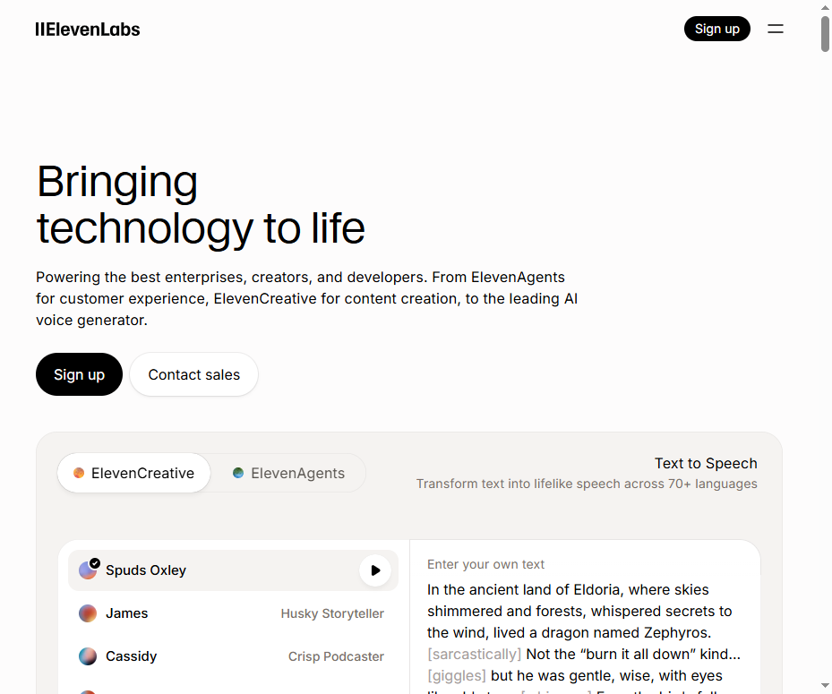
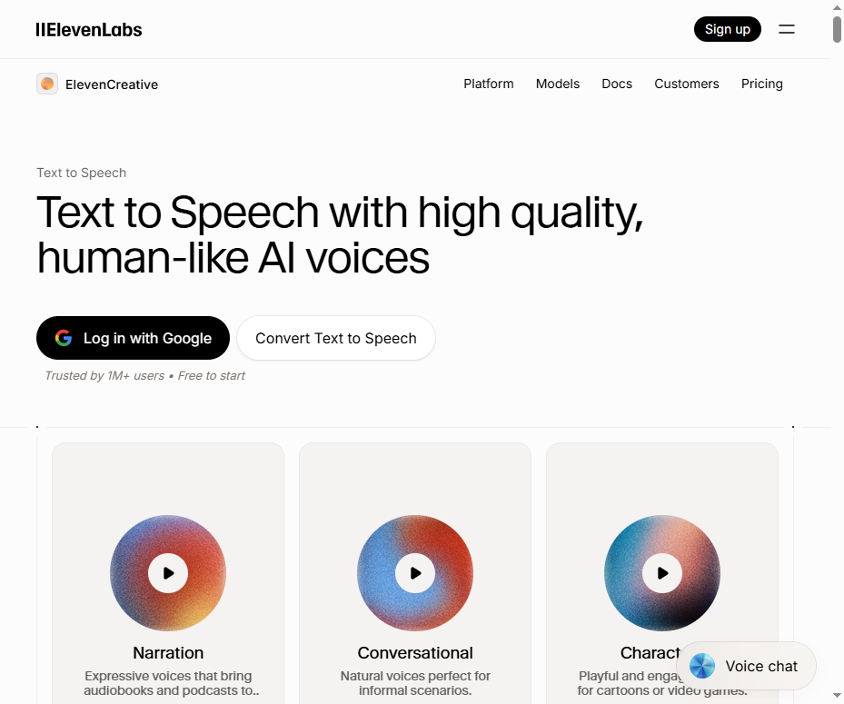
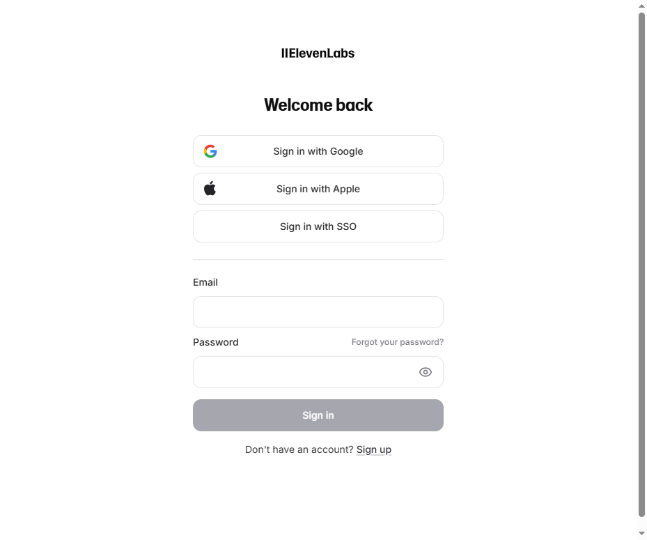
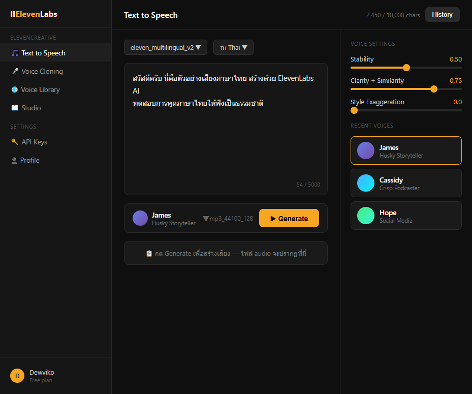
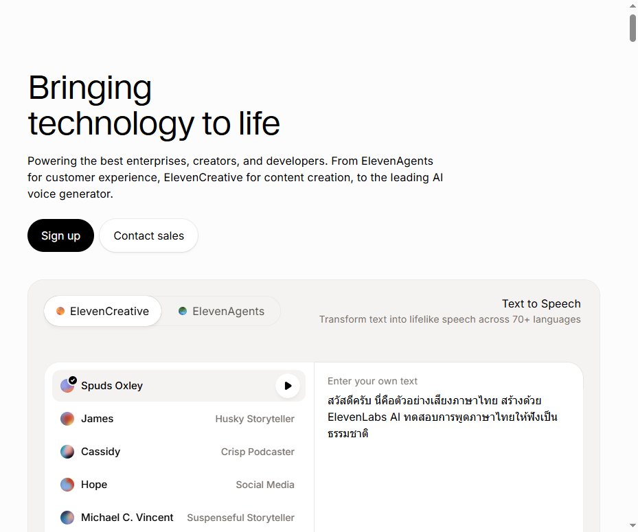
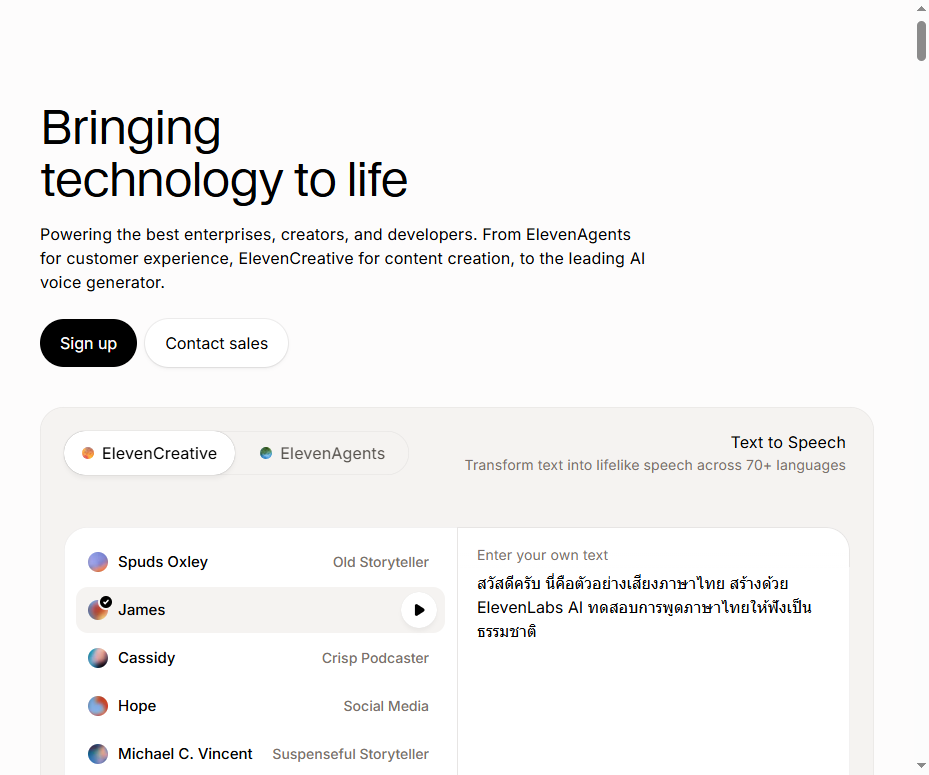
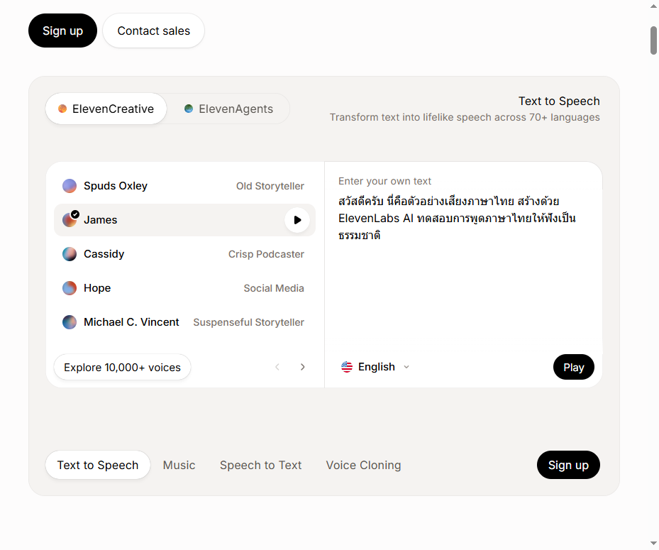
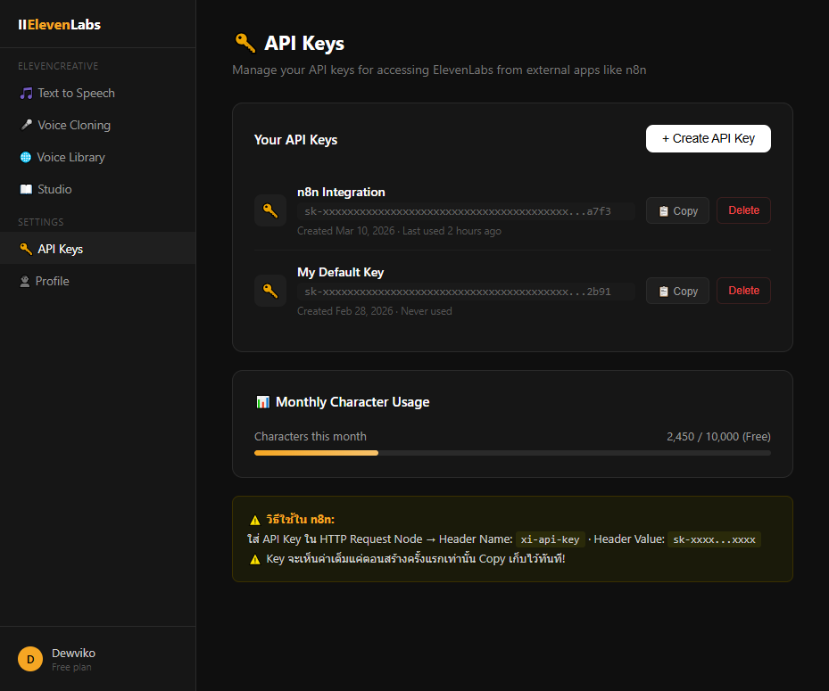

# ElevenLabs — คู่มือใช้งานเบื้องต้น

dewviko | ส่วนเสริม Chapter 2

---

ก่อนจะต่อ API กับ n8n ได้ ต้องรู้จัก ElevenLabs ให้พอก่อน

บทนี้จะพาดู 3 อย่าง:
- หน้าตา UI คืออะไร ตรงไหนทำอะไร
- วิธีสร้างเสียงภาษาไทย step by step
- วิธีสร้าง API Key แล้วเอาไปใช้ใน n8n

---
---

## PART 1 — UI Tour: หน้าตา ElevenLabs คืออะไร

### หน้าแรก (Homepage)

เปิด elevenlabs.io ครั้งแรก จะเจอหน้าแบบนี้:



**อธิบาย:**
- **IIElevenLabs** (มุมซ้ายบน) — โลโก้, กดเพื่อกลับหน้าหลัก
- **Sign up** (มุมขวาบน) — สมัครสมาชิก ต้องทำก่อนใช้ API
- **ElevenCreative / ElevenAgents** — แท็บสลับระหว่าง 2 platform หลัก
  - ElevenCreative = สร้างเสียง, คลิป, ดนตรี
  - ElevenAgents = Voice bot, chatbot
- **Text to Speech widget** (กลางหน้า) — ทดลองพิมพ์ข้อความ เลือก voice กด Play ได้เลย ไม่ต้อง login
- **Voice list ซ้าย** — รายชื่อ voice ที่ใช้ได้ เลือกได้เลย
- **Text box ขวา** — พิมพ์ข้อความที่ต้องการให้พูด

---

### หน้า Text to Speech (Marketing Page)

กด "Convert Text to Speech" หรือไปที่ elevenlabs.io/text-to-speech:



**อธิบาย:**
- **Log in with Google** — วิธีสมัคร/ล็อกอินเร็วที่สุด แนะนำตัวนี้
- **Convert Text to Speech** — เข้าแอปจริงหลัง login
- **Narration / Conversational / Character** — ประเภท voice ที่มีให้เลือก
  - Narration = เล่าเรื่อง, audiobook
  - Conversational = คุยกัน, podcast สั้น
  - Character = ตัวละคร, เกม, animation

---

### หน้า Login

เมื่อคลิกเข้าแอปจะเจอหน้า login:



**อธิบาย:**
- **Sign in with Google** — แนะนำ ง่ายและเร็วที่สุด
- **Sign in with Apple** — ถ้าใช้ Apple ID
- **Email + Password** — login แบบธรรมดา
- กด "Sign up" ถ้ายังไม่มีบัญชี

---

### Dashboard หลัก (หลัง Login)

หลัง login จะเข้าสู่ dashboard แบบนี้:



**อธิบาย sidebar (แถบซ้าย):**
- 🎵 **Text to Speech** — พิมพ์ข้อความ → ได้ไฟล์เสียง *(ใช้ใน Workshop 1)*
- 🎤 **Voice Cloning** — Clone เสียงตัวเอง *(ใช้ใน Workshop 4)*
- 🌐 **Voice Library** — เลือก voice จาก 10,000+ ตัว
- 📖 **Studio** — editor เต็มรูปแบบสำหรับ audiobook, podcast
- 🔑 **API Keys** — สร้าง key สำหรับต่อกับ n8n
- 👤 **Profile** — ตั้งค่าบัญชี, ดู plan

**อธิบายพื้นที่หลัก:**
- **eleven_multilingual_v2** — model ที่ใช้ ต้องเป็นอันนี้ถึงพูดภาษาไทยได้
- **🇹🇭 Thai** — เลือก output language ให้ตรงกับภาษาที่พิมพ์
- **Text area** — พิมพ์ข้อความที่ต้องการ (ตรงนี้จะเห็น character count ด้วย)
- **James / Voice selector** — เลือก voice ที่ต้องการ
- **▶ Generate** — กดเพื่อสร้างเสียง (เหลืองๆ มุมขวา)
- **Stability / Clarity / Style** (ขวามือ) — ปรับความ stable และ expressive ของเสียง

---
---

## PART 2 — สร้างเสียงภาษาไทย Step by Step

ทำตาม 4 step นี้แล้วจะได้ไฟล์เสียงภาษาไทยออกมา

---

### Step 1: พิมพ์ข้อความภาษาไทย

ใน text area ให้พิมพ์ข้อความที่ต้องการ:



**สิ่งที่ทำ:**
- ลบข้อความตัวอย่างออกทั้งหมด (Ctrl+A แล้ว Delete)
- พิมพ์ภาษาไทยลงไปได้เลย ระบบรองรับ Unicode
- ข้อความตัวอย่าง: *"สวัสดีครับ นี่คือตัวอย่างเสียงภาษาไทย สร้างด้วย ElevenLabs AI ทดสอบการพูดภาษาไทยให้ฟังเป็นธรรมชาติ"*

**⚠️ สำคัญ:** สำหรับ Free tier มี limit 10,000 characters/เดือน ดูตัวเลขด้านบนขวา

---

### Step 2: เลือก Voice

เลือก voice ที่ต้องการจาก list ด้านซ้าย:



**วิธีเลือก:**
- คลิกที่ชื่อ voice ด้านซ้าย → จะมี ✓ ขึ้นมา
- กด ▶ ที่ข้าง voice เพื่อ preview เสียงก่อนตัดสินใจ
- **"Explore 10,000+ voices"** — กดเพื่อดู voice library ทั้งหมด

**Voice ที่พูดไทยได้ดี:** ส่วนใหญ่ที่อยู่ใน library รองรับภาษาไทย แต่ต้องเลือก model `eleven_multilingual_v2` ด้วย

---

### Step 3: ตั้งค่า Language และกด Generate

เลื่อนลงมาจะเห็น toolbar ด้านล่าง:



**อธิบาย:**
- **🇺🇸 English ▼** — ต้องเปลี่ยนเป็น 🇹🇭 Thai ถ้าต้องการให้ออกเสียงภาษาไทยชัดขึ้น
- **Play** (ปุ่มดำ) — ทดลองฟัง preview ในหน้าเว็บ
- ใน app จริง (หลัง login) จะเป็นปุ่ม **▶ Generate** สีเหลือง → ได้ไฟล์ MP3

**ตั้งค่าใน app (สำหรับ n8n workflow):**
- Model: `eleven_multilingual_v2` ← สำคัญมาก ต้องใช้ตัวนี้
- Language: Thai
- Output format: `mp3_44100_128`

---

### Step 4: Download ไฟล์เสียง

หลังกด Generate ไฟล์เสียงจะปรากฏใต้ text box — กด Download เพื่อบันทึก

---

**Voice Settings (ปรับได้ในแท็บขวามือ):**

| Setting | ค่าแนะนำ | ผลลัพธ์ |
|---------|---------|---------|
| Stability | 0.5 | สมดุลระหว่าง consistent กับ expressive |
| Clarity + Similarity | 0.75 | เสียงชัด ใกล้เคียง voice ต้นแบบ |
| Style Exaggeration | 0.0 | ปกติ ไม่ dramatic เกิน |

ถ้าเสียงฟังดู "หุ่นยนต์" เกิน → ลด Stability ลง (0.3-0.4)
ถ้าต้องการเสียงที่ expressive กว่า → เพิ่ม Style Exaggeration (0.2-0.4)

---
---

## PART 3 — สร้าง API Key และต่อกับ n8n

### Step 1: ไปที่หน้า API Keys

ใน sidebar ซ้าย → กด **🔑 API Keys**



**อธิบาย:**
- **Your API Keys** — รายการ key ที่สร้างไว้ทั้งหมด
- **+ Create API Key** (ขาว, มุมขวา) — กดเพื่อสร้าง key ใหม่
- **sk-xxx...xxx** — ค่า key จะถูก mask ไว้ เห็นแค่ 4 ตัวท้าย
- **📋 Copy** — กดเพื่อ copy ค่า key เต็มไปใช้งาน
- **Monthly Character Usage** — ดูว่าใช้ไปเท่าไหร่ในเดือนนี้

---

### Step 2: สร้าง API Key ใหม่

กด **+ Create API Key**:

1. ใส่ชื่อ key เช่น "n8n Integration"
2. กด Create
3. **⚠️ Copy key ทันที** — ระบบจะแสดงค่าเต็มแค่ครั้งเดียว ถ้าปิดหน้าต่างไปโดยไม่ copy ต้องสร้างใหม่

Key จะมีหน้าตาแบบนี้:
```
sk-xxxxxxxxxxxxxxxxxxxxxxxxxxxxxxxxxxxxxxxxxxxxxxxx
```

---

### Step 3: ตั้งค่าใน n8n — สร้าง Credential

เปิด n8n → ไปที่ **Credentials** → กด **Add Credential** → เลือก **Header Auth**

ตั้งค่าแบบนี้:

```
Name:         ElevenLabs API Key
Header Name:  xi-api-key
Header Value: sk-xxxxxxxxxxxxxxxxxxxx  ← วาง key ที่ copy มา
```

กด **Save**

---

### Step 4: ใช้ Credential ใน HTTP Request Node

ใน Workflow → เพิ่ม **HTTP Request Node** → ตั้งค่า:

```
Method:          POST
URL:             https://api.elevenlabs.io/v1/text-to-speech/YOUR_VOICE_ID
Authentication:  Header Auth → เลือก "ElevenLabs API Key"
```

**Headers เพิ่มเติม:**
```
Content-Type: application/json
```

**Body (JSON):**
```json
{
  "text": "{{ $json.message.content }}",
  "model_id": "eleven_multilingual_v2",
  "voice_settings": {
    "stability": 0.5,
    "similarity_boost": 0.75
  }
}
```

**Options → Response → Response Format: File**
*(สำคัญมาก — ถ้าไม่ตั้งค่านี้จะได้ binary data แทนไฟล์เสียง)*

---

### ตรวจสอบว่าต่อถูก

รัน workflow แล้วดูใน Output ของ HTTP Request Node:
- ✅ เห็น binary file → สำเร็จ
- ❌ Error 401 → API key ผิด หรือ Header Name ผิด (ต้องเป็น `xi-api-key` ไม่ใช่ `Authorization`)
- ❌ Error 422 → model_id ผิด หรือ Voice ID ผิด

---

### วิธีหา Voice ID

Voice ID คือ string ยาวๆ ที่ระบุว่าใช้เสียงไหน เช่น `JBFqnCBsd6RMkjVDRZzb`

วิธีหา:
1. ไปที่ elevenlabs.io/app/voice-library
2. เลือก voice ที่ต้องการ
3. กด Use → จะเห็น Voice ID ใน URL หรือใน code snippet

หรือใช้ API เรียก GET `/v1/voices` เพื่อดู list ทั้งหมด

---
---

## Checklist ก่อนรัน Workshop 1

☑ มีบัญชี ElevenLabs (สมัครฟรีได้ที่ elevenlabs.io)
☑ สร้าง API Key แล้ว และ copy เก็บไว้
☑ หา Voice ID ที่ต้องการแล้ว
☑ ตั้งค่า Credential "ElevenLabs API Key" ใน n8n เรียบร้อย
☑ ทดสอบสร้างเสียงภาษาไทยใน dashboard ได้แล้ว (รู้ว่าเสียงเป็นยังไง)

ถ้าครบทุกข้อ → กลับไปทำ Workshop 1 ต่อได้เลย

---

*dewviko | ElevenLabs Guide v1.0 | March 2026*
